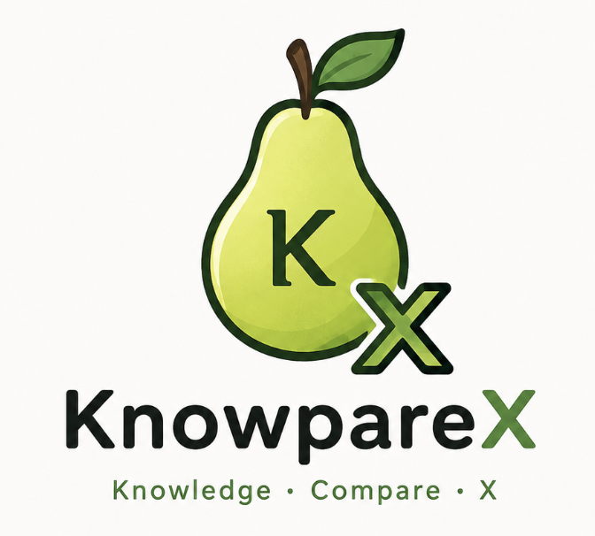

# 🍐 KnowpareX

<p align="center">
  
</p>

<p align="center">

**Connect. Compare. Understand.**  
**連結、比較、理解。**

*A structured knowledge database and learning toolkit for Python.*

**一套以結構化知識為核心的 Python 學習與查詢工具。**

</p>

---

# 📖 About / 關於 KnowpareX

KnowpareX is a reusable Python package for structured knowledge management.

It combines a searchable knowledge database, curriculum resources, relationship-based learning, and command-line tools into one package.

Whether you're reviewing science, comparing programming languages, or building educational applications, KnowpareX provides a simple and consistent way to organize and query knowledge.

KnowpareX 是一套可重複使用的 Python 套件。

它整合了：

- 📚 結構化知識資料庫
- 🎓 MindLeapX 課程資料
- 🔍 關鍵字搜尋
- 🌳 關係式知識模型
- 🖥 命令列工具（CLI）
- 🐍 Python API
- 🎯 練習、複習與比較工具

無論是學生學習、教師開發教材，或是開發教育軟體，都可以快速整合 KnowpareX。

---
# 📂 Example Applications / 範例程式

Included examples:

內建範例：

- [Compare Tool](examples/TOOL.COMPARE.py)
- [Practice Tool](examples/TOOL.PRACTICE.py)
- [Review Tool](examples/TOOL.REVIEW.py)
- [Learning Memory / 學習記憶](LEARNING_MEMORY.md)

---

# 📖 Documentation / 完整文件

Complete documentation:

完整技術文件：

[CHINESE--KNOWPAREX_API_GUIDE](KNOWPAREX_API_GUIDE.td-chi.md)<br>
[ENGLISH--KNOWPAREX_API_GUIDE](KNOWPAREX_API_GUID.en-us.md)

Includes：

包含：

- Python API
- Command Line Guide
- Relationship Functions
- Data Structure
- Registered Topics
- Developer Guide

- Python API
- CLI 指令
- 關係函式
- 資料結構
- 全部主題
- 開發者指南

---

# 👨‍💻 Who is this for? / 適合誰？

KnowpareX is designed for:

適合：

- 🎓 Students（學生）
- 👨‍🏫 Teachers（教師）
- 💻 Python Developers（Python 開發者）
- 📚 Educational Projects（教育專案）
- 🧠 Knowledge Management（知識管理）
- 🤖 Learning Applications（學習應用）

---

# ✨ Features / 功能特色

## 📚 Knowledge Database / 知識資料庫

- Structured knowledge database
- Relationship-based knowledge model
- High-school subject database
- Programming language comparisons
- Searchable topics
- JSON output

- 結構化知識資料庫
- 關係式知識模型
- 高中學科資料
- 程式語言比較
- 主題搜尋
- JSON 輸出

---

## 🎓 Curriculum Database / 課程資料

- MindLeapX curriculum database
- Subject browser
- Book browser
- Unit browser
- Lesson viewer

- MindLeapX 課程資料
- 科目瀏覽
- 冊別瀏覽
- 單元瀏覽
- 教材閱讀

---

## 🔍 Search / 搜尋

- Keyword search
- Concept scanner
- Interactive search
- Tree view
- Summary mode
- JSON export

- 關鍵字搜尋
- 文字概念掃描
- 互動式搜尋
- Tree 模式
- Summary 模式
- JSON 匯出

---

## 🎯 Learning Tools / 學習工具

- Practice mode
- Review mode
- Compare mode
- Wrong-answer tracking

- 練習模式
- 複習模式
- 比較模式
- 錯題追蹤

---

## 🐍 Python Library / Python 套件

- Python API
- Reusable modules
- Structured data
- Easy integration

- Python API
- 可重複使用模組
- 結構化資料
- 容易整合到自己的專案

---

# 📊 Current Database / 目前資料庫

Current version includes:

目前版本包含：

- **71 Categories**
- **1678 Registered Topics**
- **6871 Knowledge Relations**

資料內容持續更新中。

---

# 🚀 Installation / 安裝

Install from PyPI:

從 PyPI 安裝：

```bash
pip install knowparex
```

or

```bash
python3 -m pip install knowparex
```

Development mode：

```bash
python3 -m pip install -e .
```

---

# ⚡ Quick Start / 快速開始

Python

```python
from knowparex import get_topic_data

data = get_topic_data("有機化學", "醇")

print(data)
```

Command Line

```bash
knowparex search "歐姆定律"
```

---

# 🖥 Command Line Tools / 命令列工具

KnowpareX provides several built-in command-line tools.

KnowpareX 內建多種命令列工具。

### Knowledge / 知識庫

```text
categories
items
topic
```

### Search / 搜尋

```text
search
scan
```

### Curriculum / 課程資料

```text
curriculum subjects
curriculum books
curriculum units
curriculum lesson
```

### Learning / 學習工具

```text
practice
review
compare
```

Standalone launchers are also available.

另外也提供獨立啟動指令：

```text
knowparex-practice
knowparex-review
knowparex-compare
```

---

# 📚 Curriculum Database / 課程資料

KnowpareX includes the MindLeapX curriculum database.

KnowpareX 內建 MindLeapX 課程資料。

Curriculum data is managed separately from the knowledge database.

課程資料與一般知識資料分開管理。

You can browse：

可以瀏覽：

- Subjects（科目）
- Books（冊別）
- Units（單元）
- Lessons（教材）

Search and Scan also support：

搜尋與掃描同時支援：

- Knowledge Database
- Curriculum Database
- Both Databases

- 一般知識資料
- 課程資料
- 同時搜尋兩者

---

# 📄 License / 授權

- Python source code → MIT License
- Original educational content → CC BY-NC-SA 4.0
- Third-party content keeps its original license.

- Python 程式碼採 MIT License
- 原創教材內容採 CC BY-NC-SA 4.0
- 第三方內容維持原授權

---

# ❤️ Philosophy / 理念

> **Connect knowledge. Compare ideas. Build understanding.**

> **讓知識彼此連結，透過比較建立真正的理解。**

KnowpareX aims to make knowledge reusable, searchable, and easy to integrate into educational software.

KnowpareX 致力於打造一套可重複使用、可搜尋、可整合的知識系統，讓知識不只是閱讀，而是真正能夠被理解、比較與應用。
